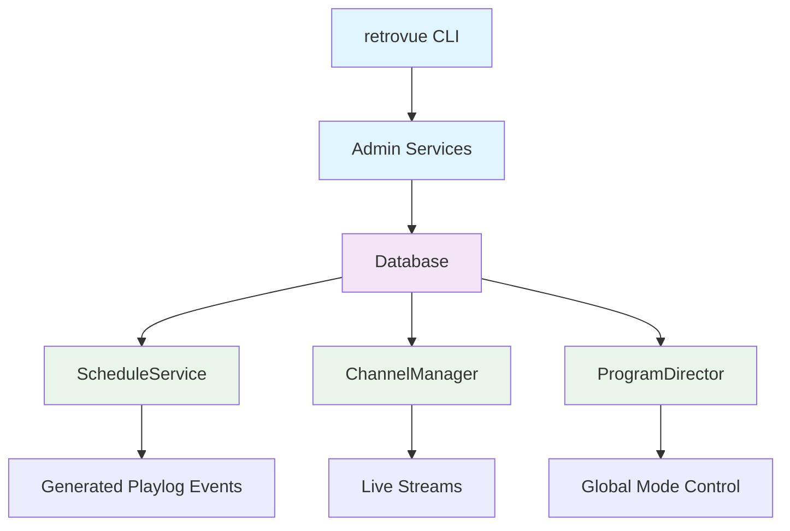
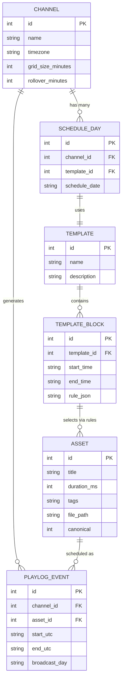

# RetroVue Infrastructure — Channel, Template & Asset Bootstrap

> Foundational database and CLI layers that must exist before ScheduleService can generate horizons or playout plans.

**Note:** This document defines the infrastructure layer that enables RetroVue's scheduling and playout systems. It establishes the data foundation that ScheduleService, ChannelManager, and ProgramDirector depend upon.

## 1. Introduction

ScheduleService cannot function until channels, templates, and assets exist in the database. The `retrovue` CLI is the operator's tool for creating and approving these foundational entities.

**Critical Separation:** Configuration data (channel/template/asset) is **read-only** for runtime services. Only the CLI and AdminService may modify these tables. ScheduleService, ChannelManager, and ProgramDirector are pure consumers of this infrastructure data.

## 2. Goals

- Define a minimal, relational schema to describe channels, templates, blocks, schedules, and assets
- Enable initialization of a complete, schedulable station using only CLI commands
- Ensure ScheduleService has a clean, read-only data contract
- Establish canonical asset gating as the approval mechanism between raw media and broadcast

## 3. System Overview



**Data Flow:**

- CLI and Admin layer are the only write paths
- ScheduleService, ChannelManager, and ProgramDirector are pure consumers
- Runtime services never mutate infrastructure tables

## 4. Table Layouts

### 4.1 Channel Configuration

| Column                | Type    | Description                                  | Example                  |
| --------------------- | ------- | -------------------------------------------- | ------------------------ |
| `id`                  | INTEGER | Primary key                                  | `1`                      |
| `name`                | TEXT    | Channel identifier                           | `"RetroVue-1"`           |
| `timezone`            | TEXT    | IANA timezone string                         | `"America/New_York"`     |
| `grid_size_minutes`   | INTEGER | Planning granularity                         | `30`                     |
| `grid_offset_minutes` | INTEGER | Offset from top of hour                      | `0`                      |
| `rollover_minutes`    | INTEGER | Broadcast day start (minutes after midnight) | `360`                    |
| `is_active`           | INTEGER | Channel operational status                   | `1`                      |
| `created_at`          | TEXT    | Creation timestamp                           | `"2025-01-15T10:30:00Z"` |

### 4.2 Template Management

| Column        | Type    | Description                 | Example                        |
| ------------- | ------- | --------------------------- | ------------------------------ |
| `id`          | INTEGER | Primary key                 | `1`                            |
| `name`        | TEXT    | Template identifier         | `"All Sitcoms 24x7"`           |
| `description` | TEXT    | Human-readable description  | `"24-hour sitcom programming"` |
| `is_active`   | INTEGER | Template operational status | `1`                            |
| `created_at`  | TEXT    | Creation timestamp          | `"2025-01-15T10:30:00Z"`       |

### 4.3 Template Blocks

| Column        | Type    | Description              | Example                                                 |
| ------------- | ------- | ------------------------ | ------------------------------------------------------- |
| `id`          | INTEGER | Primary key              | `1`                                                     |
| `template_id` | INTEGER | Foreign key to template  | `1`                                                     |
| `start_time`  | TEXT    | Block start time (HH:MM) | `"00:00"`                                               |
| `end_time`    | TEXT    | Block end time (HH:MM)   | `"24:00"`                                               |
| `rule_json`   | TEXT    | JSON rule configuration  | `{"tags": ["sitcom"], "episode_policy": "syndication"}` |
| `created_at`  | TEXT    | Creation timestamp       | `"2025-01-15T10:30:00Z"`                                |

### 4.4 Schedule Assignment

| Column          | Type    | Description                 | Example                  |
| --------------- | ------- | --------------------------- | ------------------------ |
| `id`            | INTEGER | Primary key                 | `1`                      |
| `channel_id`    | INTEGER | Foreign key to channel      | `1`                      |
| `template_id`   | INTEGER | Foreign key to template     | `1`                      |
| `schedule_date` | TEXT    | Broadcast date (YYYY-MM-DD) | `"2025-01-24"`           |
| `created_at`    | TEXT    | Creation timestamp          | `"2025-01-15T10:30:00Z"` |

### 4.5 Asset Management

| Column        | Type    | Description              | Example                  |
| ------------- | ------- | ------------------------ | ------------------------ |
| `id`          | INTEGER | Primary key              | `1`                      |
| `title`       | TEXT    | Asset title              | `"Cheers S01E01"`        |
| `duration_ms` | INTEGER | Duration in milliseconds | `1440000`                |
| `tags`        | TEXT    | Comma-separated tags     | `"sitcom,comedy"`        |
| `file_path`   | TEXT    | Local file path          | `"/media/cheers01.mkv"`  |
| `canonical`   | INTEGER | Approval status (0/1)    | `1`                      |
| `created_at`  | TEXT    | Creation timestamp       | `"2025-01-15T10:30:00Z"` |

### 4.6 Playlog Events (Generated)

| Column          | Type    | Description            | Example                  |
| --------------- | ------- | ---------------------- | ------------------------ |
| `id`            | INTEGER | Primary key            | `1`                      |
| `channel_id`    | INTEGER | Foreign key to channel | `1`                      |
| `asset_id`      | INTEGER | Foreign key to asset   | `1`                      |
| `start_utc`     | TEXT    | Start time (UTC)       | `"2025-01-24T05:00:00Z"` |
| `end_utc`       | TEXT    | End time (UTC)         | `"2025-01-24T05:30:00Z"` |
| `broadcast_day` | TEXT    | Broadcast day label    | `"2025-01-23"`           |

## 5. Relationships Summary



**Key Relationships:**

- One channel → many schedule_days
- One schedule_day → one template
- One template → many template_blocks
- Template blocks define `rule_json` for content selection
- Assets with `canonical=true` are eligible for scheduling when rules match

## 6. CLI Design — The `retrovue` Command

### 6.1 Base Syntax

```bash
retrovue <entity> <action> [parameters]
```

### 6.2 Channel Management

#### `retrovue channel add`

Create a new channel definition with broadcast policy.

```bash
retrovue channel add --name "RetroVue-1" \
  --timezone "America/New_York" \
  --grid-size 30 \
  --offset 0 \
  --rollover 360
```

**Options:**

- `--name` - Channel identifier (required)
- `--timezone` - IANA timezone string (required)
- `--grid-size` - Planning granularity in minutes (default: 30)
- `--offset` - Offset from top of hour in minutes (default: 0)
- `--rollover` - Broadcast day start in minutes after midnight (default: 360)

### 6.3 Template Management

#### `retrovue template add`

Create a reusable daypart template.

```bash
retrovue template add --name "All Sitcoms 24x7" \
  --description "24-hour sitcom programming"
```

**Options:**

- `--name` - Template identifier (required)
- `--description` - Human-readable description (optional)

#### `retrovue template block add`

Add a rule-based content block to a template.

```bash
retrovue template block add --template-id 1 \
  --start "00:00" \
  --end "24:00" \
  --tags "sitcom" \
  --episode-policy "syndication"
```

**Options:**

- `--template-id` - Template ID (required)
- `--start` - Block start time in HH:MM format (required)
- `--end` - Block end time in HH:MM format (required)
- `--tags` - Comma-separated content tags (required)
- `--episode-policy` - Episode selection policy (required)

### 6.4 Schedule Assignment

#### `retrovue schedule assign`

Link a template to a channel's broadcast day.

```bash
retrovue schedule assign --channel "RetroVue-1" \
  --template "All Sitcoms 24x7" \
  --day "2025-01-24"
```

**Options:**

- `--channel` - Channel name or ID (required)
- `--template` - Template name or ID (required)
- `--day` - Broadcast date in YYYY-MM-DD format (required)

### 6.5 Asset Management (Expanded)

#### `retrovue asset add`

Register a new asset as airable content.

```bash
retrovue asset add --title "Cheers S01E01" \
  --duration 1440 \
  --tags "sitcom,comedy" \
  --path "/media/cheers01.mkv" \
  --canonical true
```

**Options:**

- `--title` - Asset title (required)
- `--duration` - Duration in seconds (required)
- `--tags` - Comma-separated tags (required)
- `--path` - Local file path (required)
- `--canonical` - Approval status: true/false (required)

#### `retrovue asset update`

Modify existing asset metadata.

```bash
retrovue asset update --id 1 \
  --title "Cheers S01E01 - Updated" \
  --canonical false
```

**Options:**

- `--id` - Asset ID (required)
- `--title` - New title (optional)
- `--duration` - New duration in seconds (optional)
- `--tags` - New tags (optional)
- `--path` - New file path (optional)
- `--canonical` - New approval status (optional)

#### `retrovue asset list`

List assets with optional filtering.

```bash
retrovue asset list --canonical-only
retrovue asset list --tag "sitcom"
retrovue asset list --json
```

**Options:**

- `--canonical-only` - Show only approved assets
- `--tag` - Filter by specific tag
- `--json` - Output in JSON format

> **Operator Note:** The `asset` command family forms the _approval gate_ between raw media and broadcast. Only assets marked `canonical=true` are eligible for scheduling. ScheduleService never schedules media that wasn't approved via this CLI.

## 7. Example Initialization Workflow

Walk through creating a station from scratch:

```bash
# 1. Create channel with broadcast policy
retrovue channel add --name "RetroVue-1" \
  --timezone "America/New_York" \
  --grid-size 30 \
  --offset 0 \
  --rollover 360

# 2. Create daypart template
retrovue template add --name "All Sitcoms 24x7" \
  --description "24-hour sitcom programming"

# 3. Add content block to template
retrovue template block add --template-id 1 \
  --start "00:00" \
  --end "24:00" \
  --tags "sitcom" \
  --episode-policy "syndication"

# 4. Register canonical assets
retrovue asset add --title "Cheers S01E01" \
  --duration 1440 \
  --tags "sitcom" \
  --path "/media/cheers01.mkv" \
  --canonical true

retrovue asset add --title "I Love Lucy S01E02" \
  --duration 1440 \
  --tags "sitcom" \
  --path "/media/lucy02.mkv" \
  --canonical true

# 5. Assign template to channel for specific date
retrovue schedule assign --channel "RetroVue-1" \
  --template "All Sitcoms 24x7" \
  --day "2025-01-24"
```

**Result:** A complete environment ready for ScheduleService to build 24 hours of sitcom programming.

## 8. Data Ownership & Constraints

### 8.1 Write Permissions

| Component           | Channel      | Template     | Asset        | Schedule     | Playlog      |
| ------------------- | ------------ | ------------ | ------------ | ------------ | ------------ |
| **retrovue CLI**    | ✅ Write     | ✅ Write     | ✅ Write     | ✅ Write     | ❌ Read-only |
| **AdminService**    | ✅ Write     | ✅ Write     | ✅ Write     | ✅ Write     | ❌ Read-only |
| **ScheduleService** | ❌ Read-only | ❌ Read-only | ❌ Read-only | ❌ Read-only | ✅ Write     |
| **ChannelManager**  | ❌ Read-only | ❌ Read-only | ❌ Read-only | ❌ Read-only | ❌ Read-only |
| **ProgramDirector** | ❌ Read-only | ❌ Read-only | ❌ Read-only | ❌ Read-only | ❌ Read-only |

### 8.2 Canonical Gating

- Only assets with `canonical=true` may appear in any playlog or schedule
- ScheduleService is forbidden from scheduling non-canonical content
- ChannelManager must not play unapproved media
- The CLI is the sole authority for asset approval

### 8.3 Runtime Constraints

- ScheduleService is forbidden from mutating infrastructure tables
- ChannelManager and ProgramDirector are read-only consumers
- All runtime services must treat infrastructure tables as immutable
- Emergency overrides may bypass scheduling but never modify asset approval status

## 9. Future Expansion

### 9.1 Planned Growth Areas

- **Promo Integration:** Support for promos, ad categories, and multiple templates per channel
- **Series Hierarchy:** Series/episode hierarchy for structured scheduling
- **Ingest Pipeline:** Integration with ingest pipeline for automatic asset promotion
- **Advanced Rules:** Complex rule engines for content selection and scheduling policies
- **Multi-Channel:** Support for channel groups and cross-channel scheduling

### 9.2 Integration Points

- **Content Manager:** Automatic promotion from pending to canonical status
- **Review System:** Integration with review queue for asset approval workflow
- **Metadata Enrichment:** Automatic tag generation and content classification
- **Compliance:** Integration with broadcast compliance and logging systems

## 10. Acceptance Criteria

### 10.1 Database Initialization

- [ ] A new database can be initialized completely via `retrovue` commands
- [ ] All required tables exist with proper relationships
- [ ] Foreign key constraints are enforced
- [ ] Indexes are created for performance

### 10.2 CLI Functionality

- [ ] All `retrovue` commands execute without errors
- [ ] Asset approval workflow functions correctly
- [ ] Template and channel creation works as expected
- [ ] Schedule assignment produces valid results

### 10.3 Runtime Integration

- [ ] Running `ScheduleService.build_playout_horizon()` succeeds with generated playlog entries
- [ ] All runtime services treat infrastructure tables as read-only
- [ ] `retrovue asset` correctly governs canonical gating
- [ ] ChannelManager can execute scheduled content without errors

### 10.4 Data Integrity

- [ ] Canonical gating prevents unapproved content from airing
- [ ] ScheduleService cannot modify infrastructure tables
- [ ] Template rules correctly select eligible assets
- [ ] Broadcast day logic works across rollover boundaries

## 11. Cross-References

| Component                                  | Relationship                                            |
| ------------------------------------------ | ------------------------------------------------------- |
| **[ScheduleService](schedule_service.md)** | Consumes infrastructure data to generate playout plans  |
| **[ChannelManager](channel_manager.md)**   | Executes scheduled content from infrastructure          |
| **[ProgramDirector](program_director.md)** | Coordinates channels using infrastructure configuration |
| **[CLI Reference](cli-reference.md)**      | Documents the `retrovue` command interface              |

---

_Document version: v0.1 · Last updated: 2025-01-24_
